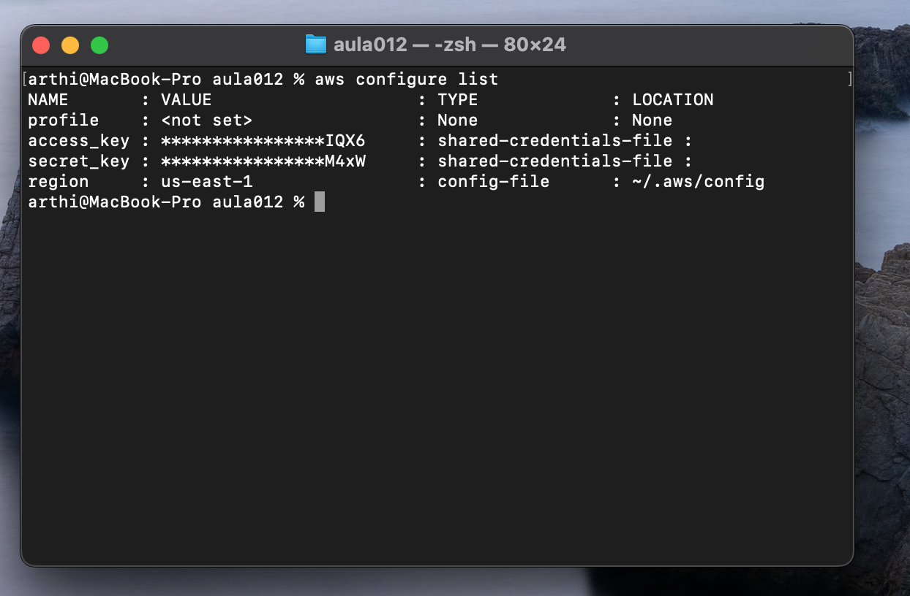
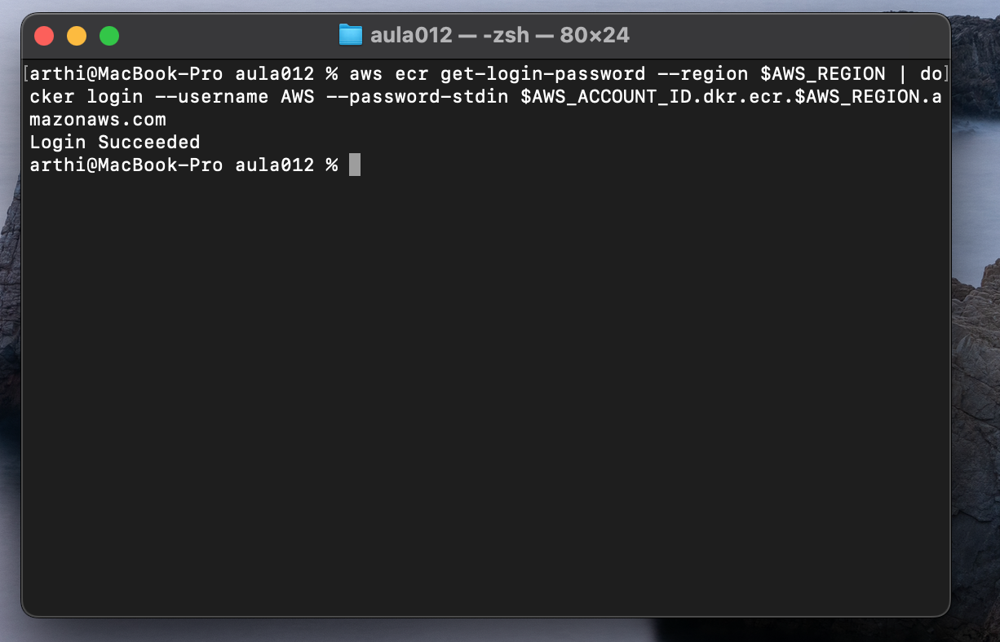
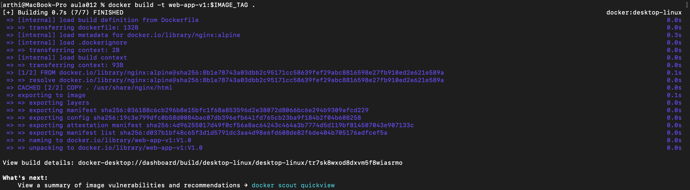
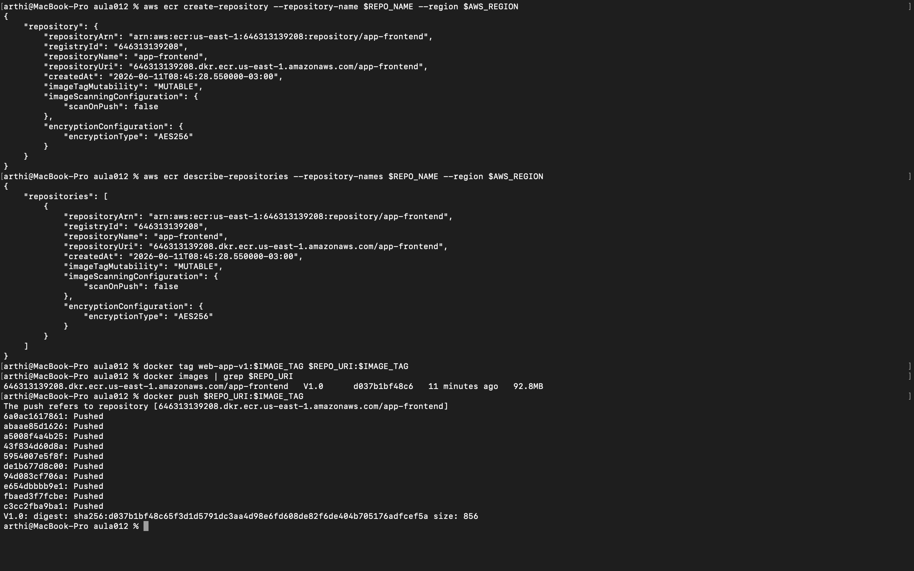
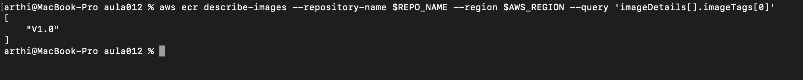

# TF - Tarefa Final - Aula 12

**Disciplina:** Implementação de servidor e nuvem (cloud)
**Aula:** 12 - CI/CD Básico e Registro de Imagens (ECR)
**RA:** 6324598

---

## Questão 1: Conceitos de CI/CD

**a) CI (Continuous Integration):**

O objetivo principal da Integração Contínua é fazer com que cada alteração de código enviada pelos desenvolvedores seja integrada ao repositório principal com frequência (várias vezes ao dia). A cada novo commit, o pipeline roda automaticamente os testes e faz o *build* da aplicação. Assim, o código de todos os desenvolvedores é validado constantemente, e qualquer erro de integração ou teste quebrado é detectado cedo, em vez de acumular problemas para descobrir só na hora de entregar.

**b) CD (Continuous Delivery/Deployment):**

A Entrega/Implantação Contínua cuida do que acontece *depois* que o artefato já foi construído e testado na fase de CI. O objetivo é pegar esse artefato pronto (no nosso caso, a imagem Docker) e levá-lo de forma automatizada até o ambiente de destino. No *Continuous Delivery* o artefato fica pronto e disponível para ser publicado com um clique/aprovação manual; no *Continuous Deployment* esse passo final também é automático, indo direto para produção sem intervenção humana.

---

## Questão 2: Ferramentas de Pipeline (CI)

Três ferramentas/serviços que podem automatizar a fase de CI (rodar testes e fazer o build da imagem Docker):

1. **GitHub Actions** — automação de workflows integrada ao GitHub, muito usada para build e testes a cada push/PR.
2. **AWS CodeBuild** — serviço gerenciado da AWS que compila o código, roda testes e gera artefatos (como imagens Docker).
3. **Jenkins** — servidor de automação open source, amplamente adotado para montar pipelines de CI/CD personalizados.

*(Outras opções válidas: GitLab CI, CircleCI, Travis CI.)*

---

## Questão 3: Amazon ECR

**a) Vantagem do ECR em relação ao Docker Hub público (privacidade/segurança):**

A grande vantagem é que o ECR é um repositório **privado e integrado ao IAM da AWS**. Isso significa que o acesso às imagens é controlado por permissões da própria conta AWS, e só quem tem credencial autorizada consegue fazer *pull* ou *push*. No Docker Hub público, qualquer pessoa pode ver e baixar a imagem, o que expõe o código e a configuração da aplicação. Para uma aplicação privada, o ECR garante que a imagem fique protegida, ainda conta com criptografia em repouso e *scan* de vulnerabilidades.

**b) ECR é regional ou global? Formato do URI:**

O ECR é um serviço **regional** — cada repositório existe dentro de uma região específica da AWS.

O formato padrão do URI de um repositório ECR é:

```
<ID_DA_CONTA>.dkr.ecr.<REGIÃO>.amazonaws.com/<NOME_DO_REPOSITORIO>
```

Exemplo: `123456789012.dkr.ecr.us-east-1.amazonaws.com/web-app-repo`

---

## Questão 4: Processo de Push

A ordem correta dos três passos para enviar uma imagem local para o ECR:

1. **Passo de Autenticação:** usando a **AWS CLI**, gera-se um token de login (`aws ecr get-login-password`) e ele é passado para o `docker login`, autenticando o Docker no registro do ECR.
2. **Passo de Tagging:** usando o **Docker CLI** (`docker tag`), marca-se a imagem local com o URI completo do repositório ECR, para que o Docker saiba para onde enviar.
3. **Passo de Upload:** usando o **Docker CLI** (`docker push`), envia-se a imagem já marcada para o repositório no ECR.

---

## Questão 5: Tarefa Prática Integrada (Simulação)

Valores assumidos:
- **ID da Conta AWS:** `123456789012`
- **Região:** `us-east-1`
- **Repositório ECR:** `web-app-repo`
- **Imagem Local:** `web-app:v1`

**a) Criação do repositório:**

```bash
aws ecr create-repository --repository-name web-app-repo --region us-east-1
```

**b) Autenticação (login Docker):**

```bash
aws ecr get-login-password --region us-east-1 | docker login --username AWS --password-stdin 123456789012.dkr.ecr.us-east-1.amazonaws.com
```

**c) Tagging da imagem:**

```bash
docker tag web-app:v1 123456789012.dkr.ecr.us-east-1.amazonaws.com/web-app-repo:v1
```

**d) Push final:**

```bash
docker push 123456789012.dkr.ecr.us-east-1.amazonaws.com/web-app-repo:v1
```

---

## Questão 6: Evidências Práticas da Execução do Lab012

> O Lab012 foi executado com sucesso. Os prints de cada etapa estão na pasta [`prints/`](./prints). Valores reais usados na execução:
>
> - **ID da Conta AWS:** `646313139208`
> - **Região:** `us-east-1`
> - **Repositório ECR:** `app-frontend`
> - **Imagem Local:** `web-app-v1:V1.0`
> - **URI do ECR:** `646313139208.dkr.ecr.us-east-1.amazonaws.com/app-frontend`

### Parte 1: Preparação e Configuração

```bash
# 1. Configuração AWS (ocultar chaves sensíveis)
aws configure list

# 2. Teste de login no ECR
aws ecr get-login-password --region $AWS_REGION | docker login --username AWS --password-stdin $AWS_ACCOUNT_ID.dkr.ecr.$AWS_REGION.amazonaws.com

# 3. Build da imagem
docker build -t web-app-v1:$IMAGE_TAG .
```

- [x] `aws configure list` — chaves ocultas — 
- [x] `Login Succeeded` no ECR — 
- [x] Build da imagem `web-app-v1:V1.0` (92.8MB) — 

### Parte 2: Registro e Push da Imagem

```bash
# 1. Criação/descrição do repositório
aws ecr create-repository --repository-name $REPO_NAME --region $AWS_REGION
aws ecr describe-repositories --repository-names $REPO_NAME --region $AWS_REGION

# 2. Tagging
docker tag web-app-v1:$IMAGE_TAG $REPO_URI:$IMAGE_TAG

# 3. Verificação local
docker images | grep $REPO_URI

# 4. Push
docker push $REPO_URI:$IMAGE_TAG
```

- [x] Criação/descrição do repositório `app-frontend` — 
- [x] Tagging da imagem + `docker images` com a imagem marcada — ver mesmo print acima (`registro-push-imagem.png`)
- [x] Push concluído — todos os layers `Pushed`, digest `sha256:...856` — ver mesmo print acima (`registro-push-imagem.png`)

  > O print [`registro-push-imagem.png`](./prints/registro-push-imagem.png) consolida em uma única captura: `create-repository`, `describe-repositories`, `docker tag`, `docker images` e `docker push` (com todos os layers `Pushed`).

### Parte 3: Verificação Remota e Bônus EKS

```bash
# Verificação no ECR
aws ecr describe-images --repository-name $REPO_NAME --region $AWS_REGION --query 'imageDetails[].imageTags[0]'

# (BÔNUS) Deploy no EKS
kubectl get deployments -n app-frontend
kubectl get pods -n app-frontend
kubectl get svc app-frontend-service -n app-frontend
curl http://$ENDPOINT
```

- [x] `describe-images` retornou `["V1.0"]`, comprovando o upload — 
- [ ] (Bônus) Deploy no EKS — não executado (gera custo de cluster/LoadBalancer)

### Parte 4: Observações

- A região utilizada foi `us-east-1` (configurada no `aws configure`), em vez de `sa-east-1`/`us-east-2` citadas como exemplo no Lab. Sem impacto, pois o ECR é regional e todos os comandos usaram a mesma variável `$AWS_REGION`.
- O Docker Desktop precisou ser iniciado antes do build (o daemon não estava rodando).
- O bônus de EKS (Seções 6 e 7) não foi executado por gerar custos contínuos na AWS (cluster EKS + LoadBalancer).
- Não houve erros durante o fluxo de build, login, tag e push.
